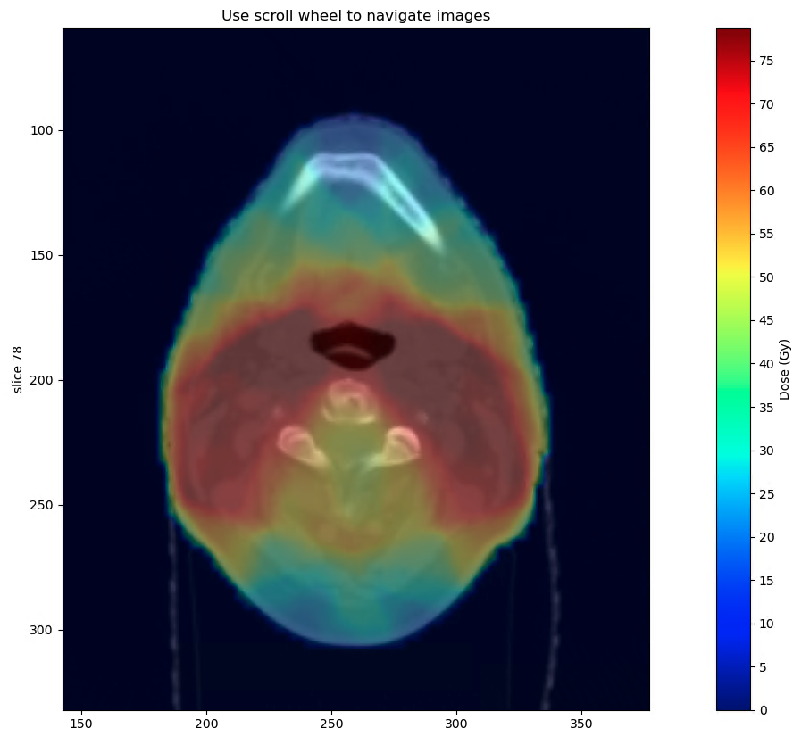

"# Plot_And_Scroll_Images" 
Used to plot and scroll through images

manipulated from https://matplotlib.org/2.1.2/gallery/animation/image_slices_viewer.html

```
from Plot_Scroll_Images import plot_scroll_Image
x = some_array
x.shape = (25, 512, 512, 1)
plot_scroll_Image(img=x)

# also support int8 mask and float dose for overlay
plot_scroll_Image(img=x, mask=mask_array, dose=dose_array, alpha=0.3)
```

<p align="center">
    
    
</p>
