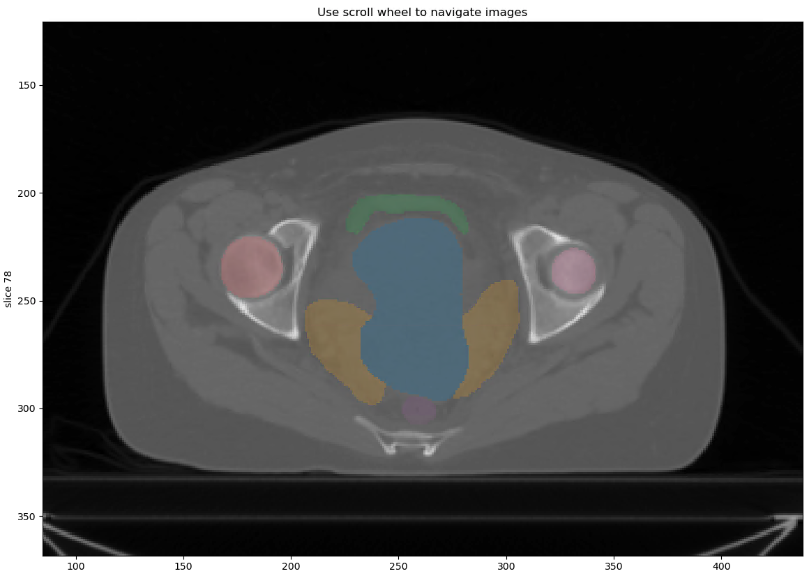
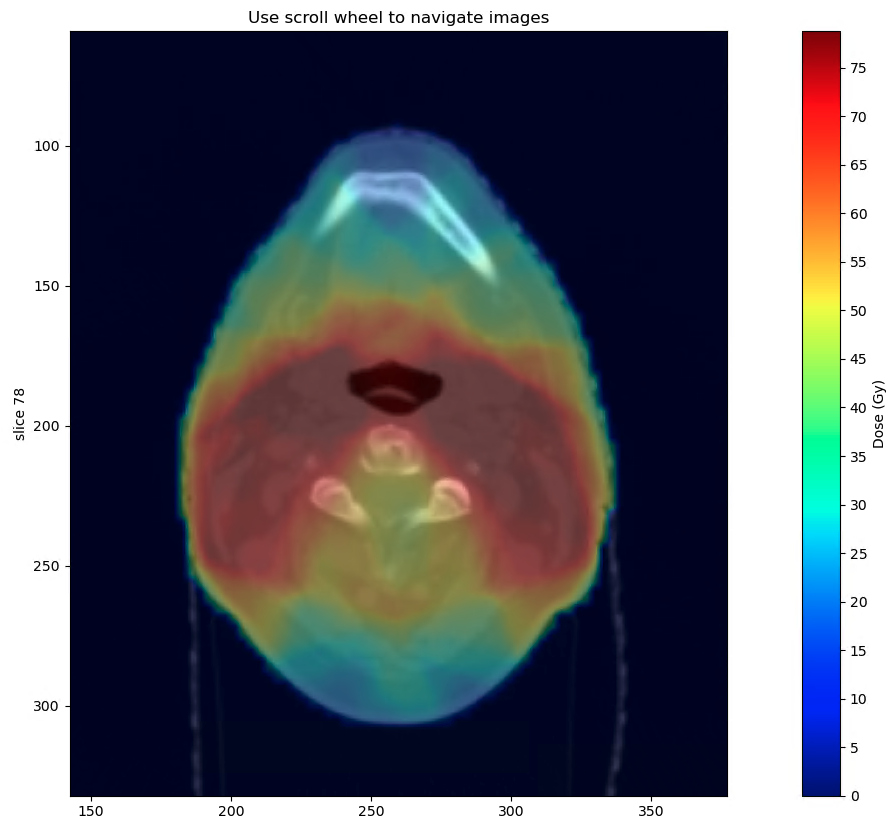

# Plot_And_Scroll_Images (PlotScrollNumpyArrays)

Small matplotlib utility for viewing a 3D NumPy image volume slice by slice: scroll through the stack with the mouse wheel, optionally overlaying an integer segmentation mask and/or a float dose distribution (rendered with a jet colormap and a Gy colorbar). Adapted from the matplotlib [image slices viewer](https://matplotlib.org/2.1.2/gallery/animation/image_slices_viewer.html) example.

## Install

Packaged as `PlotScrollNumpyArrays` and published to PyPI on version tags via GitHub Actions:

```
pip install PlotScrollNumpyArrays
```

## Usage

```python
from PlotScrollNumpyArrays import plot_scroll_Image

x = some_array          # [rows, columns, #slices] or e.g. (25, 512, 512, 1)
plot_scroll_Image(img=x)

# int mask and float dose arrays (same size as img) can be overlaid
plot_scroll_Image(img=x, mask=mask_array, dose=dose_array, alpha=0.3)
```

`plot_scroll_Image` returns the figure and an `IndexTracker` bound to the scroll wheel; inputs are squeezed/transposed to `[rows, columns, #slices]` automatically. A separate `plot_Image_Scroll_Bar_Image(x)` provides an ipywidgets `IntSlider` version for Jupyter notebooks.

<p align="center">
    
    
</p>

## Requirements

numpy, matplotlib, SimpleITK (ipywidgets optional, for the notebook slider).

Original scroll-bar code by Tucker Netherton (@tnetherton), modified by @cecardenas, modularized by @bmanderson.
